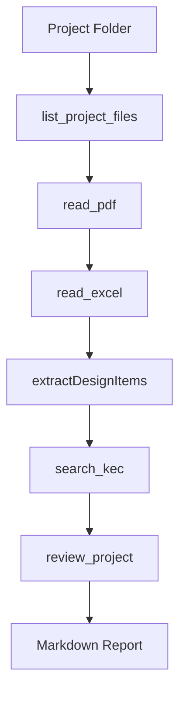

# VoltAI

VoltAI is an early electric-design AI platform built as a pnpm TypeScript monorepo. It now has three layers:

- MCP Layer: tools for project files, PDF, Excel, KEC, and agent entrypoints.
- Knowledge Layer: local KEC indexing/search with SQLite and replaceable local embeddings.
- Agent Layer: engineering review orchestration that produces a markdown design review report.

OpenAI API dependencies are intentionally not used in v0.2. LLM behavior is mocked while the workflow, evidence pipeline, and MCP runtime safety stabilize.

## Architecture

```text
VoltAI

Agent Layer
  - agent-review
  - mcp-agent

Knowledge Layer
  - KEC SQLite knowledge base
  - local placeholder embedding
  - Ollama nomic-embed-text adapter

MCP Layer
  - mcp-core
  - mcp-project-files
  - mcp-kec
  - mcp-cad
  - mcp-material
  - mcp-estimate
```

## Package Structure

```text
packages/
  mcp-core              Shared MCP factory, stdio runner, tool type, error mapping.
  mcp-project-files     Project file listing plus PDF and Excel readers.
  mcp-kec               KEC indexing/search, chunking, embeddings, SQLite store.
  mcp-agent             MCP wrapper exposing review_project.
  agent-review          Pure Agent Layer engineering review workflow.
  mcp-cad               Scaffold placeholder package.
  mcp-material          Scaffold placeholder package.
  mcp-estimate          Scaffold placeholder package.
```

## MCP Tools

| Tool | Package | Purpose |
| --- | --- | --- |
| `list_project_files` | `@voltai/mcp-project-files` | Lists `.pdf`, `.xlsx`, `.xls`, `.dwg`, `.dxf` under `PROJECT_ROOT`. |
| `read_pdf` | `@voltai/mcp-project-files` | Extracts text from PDF text layers without OCR. |
| `read_excel` | `@voltai/mcp-project-files` | Lists `.xlsx` workbook sheets or returns rows for a selected sheet using ExcelJS. Legacy `.xls` input is explicitly unsupported. |
| `index_kec` | `@voltai/mcp-kec` | Indexes KEC PDFs into the local SQLite knowledge base. |
| `search_kec` | `@voltai/mcp-kec` | Searches indexed KEC chunks and returns clause/page/text/similarity. |
| `review_project` | `@voltai/mcp-agent` | Runs the engineering review agent and returns a markdown report. |

## review_project Flow



The review agent:

- finds project files,
- reads available PDFs and Excel workbooks,
- extracts design item candidates such as cable, breaker, panel, grounding, load, and voltage drop,
- searches KEC per discovered item,
- adds relationship-based findings such as cable plus voltage drop or breaker plus load,
- emits a markdown report with required engineering review sections.

The report includes:

- `# 프로젝트 개요`
- `# 주요 설계 내용`
- `# 관련 KEC 조항`
- `# 항목별 검토`
- `# 잠재 위험`
- `# 확인 필요사항`
- `# 검토 의견`

## Requirements

- Node.js 22+
- pnpm 9+
- Optional: Ollama at `http://localhost:11434` for real local embeddings.

## Setup

```bash
pnpm install
cp .env.example .env
```

Important environment variables:

```bash
PROJECT_ROOT=./project
KEC_DB_PATH=./.voltai/kec.sqlite
KEC_EMBED_PROVIDER=placeholder
OLLAMA_BASE_URL=http://localhost:11434
OLLAMA_EMBED_MODEL=nomic-embed-text
```

Set `KEC_EMBED_PROVIDER=ollama` only when Ollama and the embedding model are available.
`MCP_TRANSPORT`, `LOG_LEVEL`, and `NODE_ENV` are not required by the current runtime and are intentionally omitted from the default environment template.

## Run

```bash
pnpm --filter @voltai/mcp-project-files dev
pnpm --filter @voltai/mcp-kec dev
pnpm --filter @voltai/mcp-agent dev
```

Scaffold packages can also run:

```bash
pnpm --filter @voltai/mcp-cad dev
pnpm --filter @voltai/mcp-material dev
pnpm --filter @voltai/mcp-estimate dev
```

## Docker

Create a local `.env` file first:

```bash
cp .env.example .env
docker compose up --build
```

Run one service:

```bash
docker compose up mcp-agent
```

`PROJECT_ROOT` is mounted read-only into `/project` for project-files and agent services.

## Test

Run all quality checks:

```bash
pnpm lint
pnpm test
pnpm build
```

Current v0.2 status:

- Test Files: 18 passed
- Tests: 117 passed

## CI

GitHub Actions runs:

```bash
pnpm install --frozen-lockfile
pnpm lint
pnpm test
pnpm build
```

## License

VoltAI is released under the MIT License. See `LICENSE` for details.
