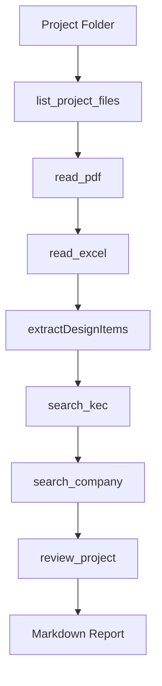

# VoltAI

VoltAI is an early electric-design AI platform built as a pnpm TypeScript monorepo. It has three layers:

- MCP Layer: tools for project files, PDF, Excel, KEC, and agent entrypoints.
- Knowledge Layer: generic typed knowledge models, SQLite storage, and KEC, Company, and Material domains.
- Agent Layer: engineering review orchestration using KEC and Company Knowledge to produce a markdown report.

Mock review remains the default. GLM can be selected explicitly and has timeout, retry, safe-failure, optional marked fallback, and a separate provider smoke command.

## Architecture

```text
VoltAI

Agent Layer
  - agent-review
  - mcp-agent

Knowledge Layer
  - knowledge-core generic types and codecs
  - knowledge-sqlite generic SQLite store
  - knowledge-company Company standards
  - knowledge-material material catalogs
  - KEC compatibility layer and Ollama embedding adapter

MCP Layer
  - mcp-core
  - mcp-project-files
  - mcp-kec
  - mcp-company
  - mcp-material
  - mcp-cad
  - mcp-estimate
```

## Package Structure

```text
packages/
  mcp-core              Shared MCP factory, stdio runner, tool type, error mapping.
  mcp-project-files     Project file listing plus PDF and Excel readers.
  knowledge-core        Generic knowledge documents, chunks, citations, codecs, and store contracts.
  knowledge-sqlite      Generic SQLite knowledge store and compatibility migration.
  knowledge-company     Company Knowledge indexing, search, metadata, and citation adapters.
  knowledge-material    Material Knowledge workbook mapping, indexing, search, and citations.
  mcp-kec               KEC indexing/search, chunking, embeddings, SQLite store.
  mcp-company           index_company and search_company MCP tools.
  mcp-material          index_material and search_material MCP tools.
  mcp-agent             MCP wrapper exposing review_project.
  agent-review          Typed review workflow using KEC and Company Knowledge.
  mcp-cad               Scaffold placeholder package.
  mcp-estimate          Scaffold placeholder package.
```

## MCP Tools

| Tool | Package | Purpose |
| --- | --- | --- |
| `list_project_files` | `@voltai/mcp-project-files` | Lists `.pdf`, `.xlsx`, `.xls`, `.dwg`, `.dxf` under `PROJECT_ROOT`. |
| `read_pdf` | `@voltai/mcp-project-files` | Extracts text from PDF text layers without OCR. |
| `read_excel` | `@voltai/mcp-project-files` | Lists `.xlsx` workbook sheets or returns rows for a selected sheet using ExcelJS. Legacy `.xls` input is explicitly unsupported. |
| `index_kec` | `@voltai/mcp-kec` | Indexes KEC PDFs into the local SQLite knowledge base. |
| `search_kec` | `@voltai/mcp-kec` | Searches indexed KEC chunks and returns clause/page/text/similarity. |
| `index_company` | `@voltai/mcp-company` | Indexes a Company standard PDF. |
| `search_company` | `@voltai/mcp-company` | Searches indexed Company standards. |
| `index_material` | `@voltai/mcp-material` | Indexes one selected material workbook sheet without deleting other sheets. |
| `search_material` | `@voltai/mcp-material` | Searches indexed material catalog rows. |
| `review_project` | `@voltai/mcp-agent` | Runs the engineering review agent and returns a markdown report. |

## review_project Flow


```mermaid
graph TD
A[Project Folder]
-->B[list_project_files]
-->C[read_pdf]
-->D[read_excel]
-->E[extractDesignItems]
-->F[search_kec]
-->G[search_company]
-->H[review_project]
-->I[Markdown Report]
```

The review agent:

- finds project files,
- reads available PDFs and Excel workbooks,
- extracts design item candidates such as cable, breaker, panel, grounding, load, and voltage drop,
- searches KEC and Company Knowledge per discovered item,
- adds relationship-based findings such as cable plus voltage drop or breaker plus load,
- emits a markdown report with required engineering review sections.

The report includes:

- `# 프로젝트 개요`
- `# 주요 설계 내용`
- `# 관련 KEC 조항`
- `# 항목별 검토`
- `# 잠재 위험`
- `# 확인 필요사항`
- `# 검토 의견`

## Requirements

- Node.js 22+
- pnpm 9+
- Optional: Ollama at `http://localhost:11434` for real local embeddings.

## Setup

```bash
pnpm install
cp .env.example .env
```

Important environment variables:

```bash
PROJECT_ROOT=./project
KEC_DB_PATH=./.voltai/kec.sqlite
KNOWLEDGE_DB_PATH=./.voltai/knowledge.sqlite
KEC_EMBED_PROVIDER=ollama
COMPANY_EMBED_PROVIDER=placeholder
MATERIAL_EMBED_PROVIDER=placeholder
OLLAMA_BASE_URL=http://localhost:11434
OLLAMA_EMBED_MODEL=nomic-embed-text
```

KEC_EMBED_PROVIDER is required; choose `ollama` for pilot data or explicitly choose `placeholder` for deterministic local development. The placeholder is intended for offline tests and does not represent production retrieval quality. Company and Material providers are also fail-closed and currently accept explicit `placeholder` only.
`MCP_TRANSPORT`, `LOG_LEVEL`, and `NODE_ENV` are not required by the current runtime and are intentionally omitted from the default environment template.

## Run

```bash
pnpm --filter @voltai/mcp-project-files dev
pnpm --filter @voltai/mcp-kec dev
pnpm --filter @voltai/mcp-company dev
pnpm --filter @voltai/mcp-material dev
pnpm --filter @voltai/mcp-agent dev
```

### Default KEC runtime

The default KEC runtime remains legacy-only. Run it with `pnpm --filter @voltai/mcp-kec dev`; it exposes exactly `kec_placeholder`, `index_kec`, and `search_kec`.

### Explicit KEC hybrid runtime

The hybrid runtime is opt-in and the default runtime remains unchanged and legacy-only. Start the explicit runtime in development with:

```bash
pnpm --filter @voltai/mcp-kec dev:hybrid
```

Run its built output with:

```bash
pnpm --filter @voltai/mcp-kec start:hybrid
```

Both `KEC_HYBRID_SEMANTIC_WEIGHT` and `KEC_HYBRID_LEXICAL_WEIGHT` values are required. They must be unsigned finite decimal values and non-negative, with at least one weight greater than zero. The values are not normalized automatically.

```bash
KEC_HYBRID_SEMANTIC_WEIGHT=0.7 \
KEC_HYBRID_LEXICAL_WEIGHT=0.3 \
pnpm --filter @voltai/mcp-kec dev:hybrid
```

Invalid configuration values fail before STDIO transport starts. The explicit runtime exposes exactly `kec_placeholder`, `index_kec`, `search_kec`, and `search_kec_hybrid`.

Embedding provider selection remains controlled by the existing KEC provider configuration through `KEC_EMBED_PROVIDER`, `OLLAMA_BASE_URL`, `OLLAMA_EMBED_MODEL`, and `OLLAMA_EMBED_TIMEOUT_MS`. The `placeholder` provider is appropriate only for transport or pipeline validation. Ollama can provide real local embeddings when separately configured after installation. This task does not install Ollama, and this runtime does not validate Ollama model availability at startup. No fallback provider is selected automatically.

Runtime availability does not establish retrieval quality. Placeholder semantic scores are not retrieval-quality evidence. Meaningful quality evaluation requires a representative KEC corpus and a real embedding provider. No Recall, MRR, NDCG, ranking threshold, or production-quality claim is made by this runtime.

No automatic reindex occurs. The existing database and provider lifecycle remains per tool call. The runtime command supplies only ranking configuration and server composition; it does not change the search schema or output contract.

Remaining scaffold packages can also run:

```bash
pnpm --filter @voltai/mcp-cad dev
pnpm --filter @voltai/mcp-estimate dev
```

## Docker

Create a local `.env` file first:

```bash
cp .env.example .env
docker compose up --build
```

Run one service:

```bash
docker compose up mcp-agent
```

`PROJECT_ROOT` is mounted read-only into `/project` for project-files and agent services.

## Test

Run all quality checks:

```bash
pnpm lint
pnpm test
pnpm build
```

Current pre-pilot status:

- Test Files: 77 passed
- Tests: 442 passed

Provider-only GLM connectivity is opt-in:

```bash
npx pnpm@9.15.4 --filter @voltai/agent-review smoke:glm
```

The normal suite never calls GLM or another paid provider.

## CI

GitHub Actions runs:

```bash
pnpm install --frozen-lockfile
pnpm lint
pnpm test
pnpm build
```

## License

VoltAI is released under the MIT License. See `LICENSE` for details.

<!-- TASK 56 KEC INDEX DIAGNOSTICS START -->

### Read-only KEC index diagnostics

Run the short-lived diagnostic command with:

```bash
pnpm --filter @voltai/mcp-kec inspect:index
```

This is not an MCP server. It does not perform indexing or search, does not contact an embedding provider, and introduces no new environment variables.

`KEC_DB_PATH` has precedence when it is set. A relative KEC_DB_PATH value resolves from the current working directory. When it is absent, the command uses `PROJECT_ROOT/.voltai/kec.sqlite`.

Successful inspection emits one JSON line and exits with code 0 for `MISSING_DATABASE`, `UNINITIALIZED_DATABASE`, `EMPTY_INDEX`, `READY`, and `INCONSISTENT`. An `INCONSISTENT` result exits successfully because the inspection completed. A failure uses exit code 1. Inspecting a missing database does not create files or directories.

Source paths are represented only by a hashed sourceId. Provider/model metadata is collection-level and cannot prove per-chunk provider/model provenance.

These diagnostics are not retrieval-quality evidence and do not validate Ollama health. The command does not repair, migrate, delete, rebuild, or reindex data. It also does not check whether source files still exist.
<!-- TASK 56 KEC INDEX DIAGNOSTICS END -->

<!-- TASK57_OLLAMA_EMBEDDING_SMOKE_START -->

### Ollama embedding smoke validation

Run the short-lived command with:

```bash
pnpm --filter @voltai/mcp-kec smoke:ollama
```

This command is not an MCP server and does not start an MCP server. It sends at most one request, performs no retries, and uses the Ollama `/api/embeddings` endpoint with the fixed, non-PII probe text `volt-ai-ollama-embedding-smoke-v1`.

The command reads only the existing `KEC_EMBED_PROVIDER`, `OLLAMA_BASE_URL`, `OLLAMA_EMBED_MODEL`, and `OLLAMA_EMBED_TIMEOUT_MS` settings. It requires `KEC_EMBED_PROVIDER=ollama`. The other settings default to `http://localhost:11434`, `nomic-embed-text`, and `30000 ms`, respectively. Invalid configured values fail instead of silently using a default or fallback.

Success prints one redacted JSON line containing only `schemaVersion`, status `READY`, provider `ollama`, and `observedDimension`, then exits with code 0. The command does not print endpoint, model, vector, response body, or error details. Failures exit with code 1 and report exactly one of `INVALID_CONFIGURATION`, `ENDPOINT_UNAVAILABLE`, `REQUEST_TIMEOUT`, `REQUEST_REJECTED`, `INVALID_RESPONSE`, or `INTERNAL_ERROR`.

The smoke command does not access SQLite, read or write an index, perform indexing or search, access project files, start MCP, pull or install a model, or repair or reindex data. Task 55 owns index write compatibility, and Task 56 owns existing index diagnostics.

Ollama server-side model loading, cache, and pull behavior are outside VoltAI guarantees. `/api/embeddings` support depends on the installed Ollama version and configuration. `READY` means only that a usable vector response was received; there is no retrieval-quality guarantee and no index-compatibility guarantee.

<!-- TASK57_OLLAMA_EMBEDDING_SMOKE_END -->

<!-- TASK58_KEC_BATCH_INDEX_START -->

### Deterministic explicit KEC batch indexing

Run one short-lived operation with one or more canonical project-relative PDF paths using lowercase `.pdf` extensions:

```bash
pnpm --filter @voltai/mcp-kec index:batch kec/a.pdf kec/b.pdf
```

`PROJECT_ROOT` is required, and every source must remain within it. The command reuses `KEC_DB_PATH`, `KEC_EMBED_PROVIDER`, `OLLAMA_BASE_URL`, `OLLAMA_EMBED_MODEL`, `OLLAMA_EMBED_TIMEOUT_MS`, `KEC_EMBED_CONCURRENCY`, `KEC_EMBED_MAX_ATTEMPTS`, and `KEC_EMBED_RETRY_DELAY_MS`; Task 58 adds no environment variables. Directories, aliases, duplicate sources, recursion, globbing, discovery, manifest input, and stdin input are rejected or unsupported.

Each source ID is the full `kecsrc_` prefix plus SHA-256 derived from its canonical path. Sources run in deterministic sourceId order, sequentially, with no source-level concurrency. One source completes before the next starts. Task 55 retains ownership of write compatibility and the existing per-chunk retry and embedding concurrency behavior; Task 58 adds no batch retry and no source-level retry.

Each source uses the existing one-source transaction. The batch fails fast: prior committed sources remain, the failing source is `FAILED`, and later sources are `NOT_ATTEMPTED`. There is no whole-batch atomicity, no rollback of earlier sources, and no continue-on-error behavior.

`SUCCEEDED` exits with code 0. Configuration, preflight, runtime, finalization, and internal errors exit with code 1. `PARTIAL` and source-level `FAILED` results exit with code 2. A completed result is compact JSON on stdout; fixed error messages use stderr. Raw source paths are never output, nor are vectors, text, provider errors, or the database path. A sourceId is a deterministic pseudonym, not a secret or anonymous identifier.

Task 56 remains the separate read-only diagnostics command. Task 57 remains the separate explicit Ollama smoke command, and this batch command does not automatically run that smoke. It provides no directory discovery or globbing, no batch-wide atomicity, no rollback of earlier sources, no stale-source deletion, no unchanged-file detection, no content deduplication, no resume or checkpoint support, no provider fallback, no model pull or startup, no MCP registration, no search registration, and no semantic-quality guarantee.

<!-- TASK58_KEC_BATCH_INDEX_END -->

<!-- TASK59_KEC_DIRECTORY_BATCH_START -->

### Deterministic KEC directory batch indexing

Run the command with exactly one explicit project-relative directory:

```bash
pnpm --filter @voltai/mcp-kec index:directory kec/manuals
```

Discovery is non-recursive and inspects direct children only. It includes regular files ending in lowercase `.pdf`; non-PDF entries are ignored, as are uppercase `.PDF` files and nested directories. Directory and source symlinks are rejected and never followed. A directory with zero eligible sources is rejected with `NO_SOURCES`, and Task 59 adds no arbitrary source cap.

Task 58 existing indexing and result semantics are reused, including canonical source validation, sourceId ordering, sequential fail-fast execution, serialization, and exit behavior. Task 59 provides no recursive traversal, no pruning or stale-source deletion, no incremental or unchanged-file indexing, no resume or checkpoint behavior, and no MCP registration.

<!-- TASK59_KEC_DIRECTORY_BATCH_END -->
